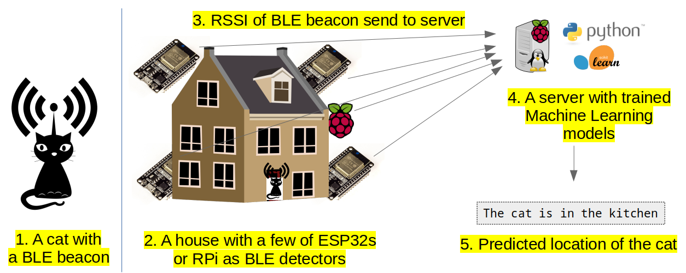
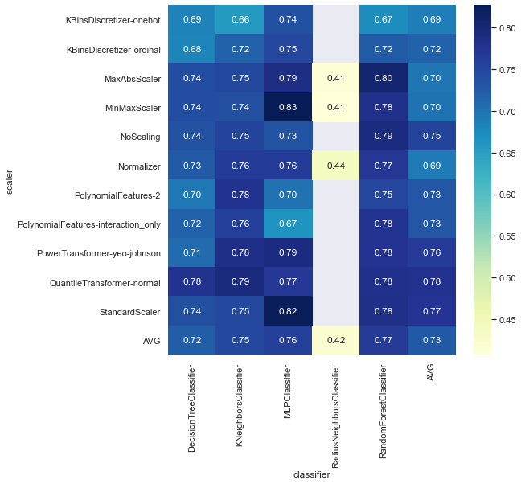
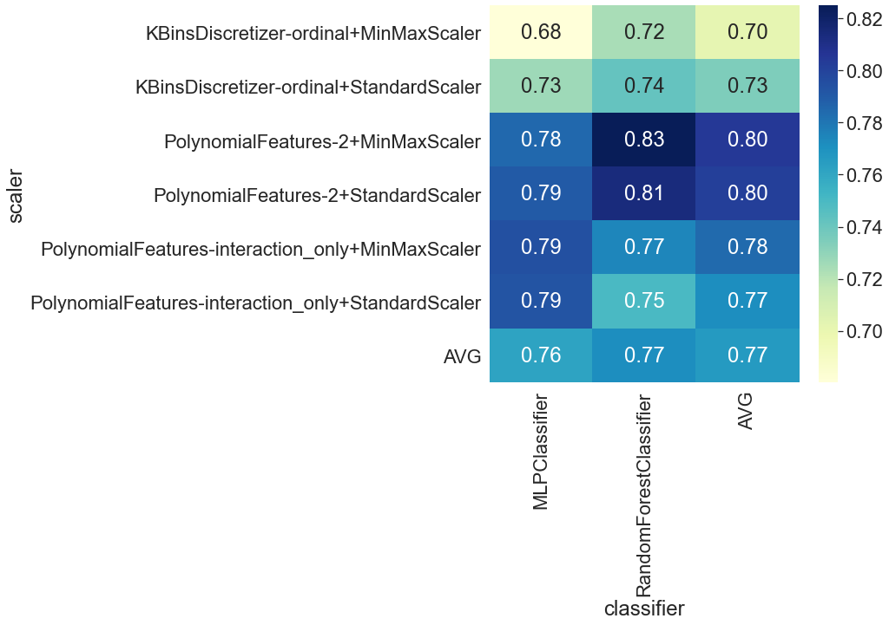
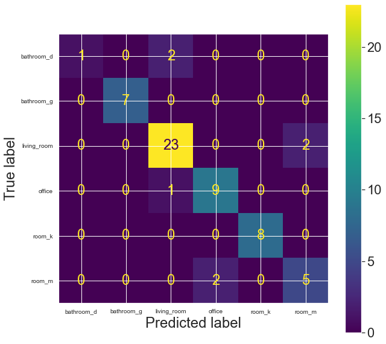

Cat detector with BLE beacon, ESP32s, and Machine Learning
=========================

**tl;dr / abstract**. System which can be used for localization the position of a cat in a building using bluetooth low energy (BLE) beacons attached to the object, a set of cheap ESP32 detectors, and Machine Learning models.

<!-- TOC START min:1 max:6 link:true asterisk:false update:true -->
- [How it works](#how-it-works)
- [Hardware setup](#hardware-setup)
- [Software setup](#software-setup)
  - [BLE beacon](#ble-beacon)
  - [Detectors](#detectors)
    - [ESP32](#esp32)
    - [Raspberry Pi](#raspberry-pi)
  - [On the server](#on-the-server)
    - [0. Data source](#0-data-source)
    - [1. Python environment](#1-python-environment)
    - [2. Program for cat localization prediction](#2-program-for-cat-localization-prediction)
- [Training and testing of ML models](#training-and-testing-of-ml-models)
  - [Data collection](#data-collection)
  - [Algorithms evaluation and models training](#algorithms-evaluation-and-models-training)
  - [Conclusions](#conclusions)
- [Detecting](#detecting)
- [Tips and tricks](#tips-and-tricks)
- [Improvements of the accuracy](#improvements-of-the-accuracy)
- [Further directions](#further-directions)
- [Acknowledgements](#acknowledgements)
<!-- TOC END -->


# How it works

This is an overwiev of a pipeline for creating an inhouse cat localizator. Actually, it can be applied to any animal (including humans) or object, and any building. The system works as follows:



- The cat with a small BLE beacon, is emiting BLE signals
- BLE signal is detected by ESP32s located here and there; they are measuring he signal strength of the BLE beacon.
- Each ESP32 sends data to the server (database)
- The python program is fetching the last measurements from all ESP32 detectors (i.e., signal strenght values)
- Using trained machine learning models it predicts the location of the cat

:bulb: The challenge here is to use a number of detectors which is significantly lower than the number of rooms and make ML do the rest.

:bulb: This is *not a ready-to-use* set of programs. As each situation is different (i.e, hardware setup, house size, number of rooms etc), please treat this repo as a framework to build and customize your own system.

# Hardware setup

- **Moving object to track.** A cat. A dog is also fine. Be careful with fishes. Can be more than one. I used two cats. 💰 ~ 0 $
- **BLE Transmitters**. [A BLE beacon](https://en.wikipedia.org/wiki/Bluetooth_low_energy_beacon). Anything will be good. I used [NotiOne](https://notione.com/) buttons, they work well and has an additional functionality (not used here). But something cheaper will work too. 💰 n x 10-20 $
- **BLE detectors**. I used four ESP32. I guess 4-6 for moderate house/flat should be enough. One can use also modern raspberry pi with BLE. 💰 n x 4 $
- **Data processing**. A server/computer. I worked with amd64 Debian, but any Raspberry Pi should be also good. Can be remote.
- WiFi Connectivity (ESPs to the server)

Optional:
- LCD display showing the current location of the cat. I'm using TTGO1

# Software setup

## BLE beacon

Nothing to configure nor code here :-)

## Detectors
###  ESP32

I provide a simple C/Arduino code for the detector. Of course it can do much more (my ESPs also measure temperature, humidity and other parameters):

- [simple C/Arduino program for BLE scanning and talking with a server](2-ESP32/esp32-ds18b20-strych.ino)

Many things can be tuned and optimized (eg array of MAC addreses instead of single variables, reading MAC addresses from the server etc).

### Raspberry Pi

(this solution was not thoroughly tested!)

Raspberry Pi with a BLE capability can be included in the set of detectors. The commands here are:

```sh
btmon &
hcitool lescan --duplicates | grep MAC
```

and next sending to the database.

## On the server

### 0. Data source

We need a server with a database. I use influx, but any will be good (MySQL or even text files!)

### 1. Python environment

I used Python 3.8.
- libraries: scikit and pandas, and whatever is needed to fetch data from the database
- please see a sample conda environment file to see what is my setup
- remember that the trained ML models must be next used in the same environment (the same scikit and numpy version!); this can be guaranteed by using the dedicated cond environment

Sample conda environment can be impotred by issuing (this is a single time procedure):
```
conda env create -f cat-localizer.yml
```

and activated by:

```
conda activate cat-localizer
```

Training of ML models can be done on any computer (eg laptop) and next models transfered to the main server. Remember to keep the same modules version (use conda environment). See the next section on model training.

### 2. Program for cat localization prediction

When models are trained and ready (see the next section), we use python program to fetch last BLE signal strength data and - basing on this - predict localization of the cat. Please see the section [Detecting](#detecting) for more info and code samples.


# Training and testing of ML models

## Data collection

Here we collect data for training ML algorithms. This means we have to collect signal strength data from all sensors WITH associated localization of the beacon. I.e, lets assume we have four ESP32 sensors, we need to create table like this one:

|measurement id|time        |target |esp32-attic|esp32-room_k|esp32-office|esp32-doors|
|------|-----------------|-------|-----------|------------|------------|-----------|
|0     |2021-01-03 15:32 |office |-71.0      |-110.0      |-71.5       |-83.0      |
|1     |2021-01-03 15:33 |office |-73.0      |-110.0      |-82.5       |-82.5      |
|2     |2021-01-03 15:34 |office |-81.0      |-110.0      |-80.0       |-87.5      |
|3     |2021-01-03 15:35 |office |-75.0      |-110.0      |-86.5       |-86.5      |
|4     |2021-01-03 15:36 |office |-72.5      |-110.0      |-78.5       |-81.0      |
|...   |...              |...    |...        |...         |...         |...        |
|236   |2021-01-03 21:56 |room_k |-100.5     |-67.5       |-110.0      |-91.5      |
|237   |2021-01-03 21:57 |room_k |-86.0      |-60.0       |-110.0      |-91.5      |
|238   |2021-01-03 21:58 |room_k |-88.5      |-93.5       |-110.0      |-91.5      |
|239   |2021-01-03 21:59 |room_k |-86.0      |-75.0       |-110.0      |-91.5      |
|240   |2021-01-03 22:00 |room_k |-87.0      |-72.0       |-110.0      |-84.5      |

where each row (measurement) represent RSSI values read from beacon at a given location **at the same time**. Please see [jupyter notebook](4-ML/1-process_data.ipynb) for the data preprocessing.

When this table is ready, we can go further and train ML models.

The number of data points (i.e, different locations of BLE beacon) for each room is variable and depends on the room size. In my case it was like here:

```
room           no of measurements
bathroom_d      11
bathroom_g      30
living_room    101
office          38
room_k          32
room_m          28
```

Remember to sample space available for your cats, so not only flors, but also tables, wardrobes, or chandelier etc ;-)

## Algorithms evaluation and models training

Now we will probe several preprocessing algorithms together with several  Machine Learning methods. We don't know which one will be the best in our case, so we will probe them all in a cross-validation experiment.

Please see [jupyter notebook](4-ML/1-process_data.ipynb) for the exact pipeline.

The final models will be build with at 75% of the dataset (training), while 25% will seve as a testing dataset.

## Conclusions

The ML algos cv results is shown here (balanced accuracy values are shown):



we can see that in our case, the MLP Classifier with Min-Max Scaler gives the best results.

Let's see if we can go any further with some features engeneering:



The nswer is no. The best accuracy here is the same as an initial setup (0.83), so we will stay with the MLP Classifier with Min-Max Scaler.

The final models build with MLP Classifier with Min-Max Scaler gives the balanced accuracy equal 0.88. Very good! If we look at the confusion matrix:



we will see that (believe me or not) all miss-labelled predictions are for locations which are close to each other (eg. room_m is close in space to the office etc.). So this makes a perfect sense.


# Detecting

For the detection you can use the code snippet in the section 6 of [jupyter notebook](4-ML/1-process_data.ipynb#Reuse-saved-models-for-new-predictions) or the code of the [simple program](3-server/localize-cat.py). The program uses numpy array as a data source, but it can be read from the file or fetched from the database.

# Tips and tricks
- gathering data for training ML. I used 1-minutes interval of collecting data. This gave me time to change the position of beacons in the room. Measurements were automatically stored in the database (influx). I noted the time span of collectiong data in a given room and then fetched data from db for this time period, assigned a room label, and saved in a csv file.
- for collection of data for a flat surfaces (floors) you can use devices such as roomba with beacons attached at the top of it. Works fine!

# Improvements of the accuracy

- Optimization of the position of ESP32 detectors, to cover whole space and give unique signal patterns for each rooms
- Optimization of ML algorithms and parameters
- Increasing number of ESP32 detectors (but this is not a chalenge :))
- (?) Take into account the battery level of the BLE beacon, as this could have impact on the transmitting power. I'm not sure.

# Further directions

- after some time of collecting the localization data for objects, we may create another ML model for predicting the localization of object in time (i.e., if it is Monday morning, the cat is near the fridge, if it is Saturday afternoon, the cat is sleeping in the bathroom, etc). This could involve another variables, like room temperature, humidity etc.

# Acknowledgements

- wikimedia commons and openclipart library for cool graphics (especially the cat!)
